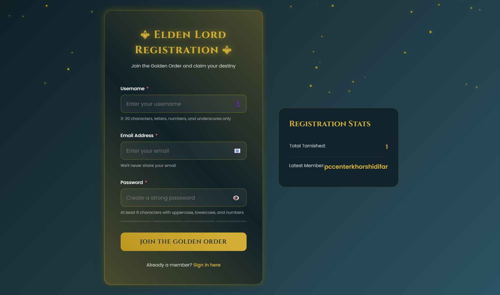

# ⚔️ Elden Lord Registration System

A modern, fully-featured registration form with real-time validation, local storage persistence, and beautiful animations - built with vanilla HTML, CSS, and JavaScript.



## 🌐 Demo Preview
🔗 *Live Demo:* (https://mehdi-dev-sudo.github.io/Elden-ring-Registration-System/)

## ✨ Features

### 🎯 Core Functionality
- **Real-time Form Validation** with instant feedback
- **LocalStorage Integration** - persistent user data
- **Password Strength Meter** with visual indicators
- **Duplicate Detection** - prevents duplicate usernames/emails
- **Stats Dashboard** - shows total registered users
- **Success Modal** with smooth animations

### 🎨 UI/UX
- **Responsive Design** - works on all devices
- **Animated Particles Background** using Canvas API
- **Smooth Transitions** and micro-interactions
- **Accessibility First** - ARIA labels, keyboard navigation
- **Password Toggle** - show/hide functionality
- **Loading States** - visual feedback during submission

### 🛡️ Validation Rules
- **Username**: 3-20 characters, alphanumeric + underscore
- **Email**: Valid email format, uniqueness check
- **Password**: Minimum 8 characters, strength meter

## 🚀 Quick Start

### Option 1: Direct Open
1. Download/clone the repository
2. Open `index.html` in your browser
3. Start registering!

### Option 2: Local Server (Recommended)
```bash
# Python 3
python -m http.server 8000

# Node.js
npx http-server

# PHP
php -S localhost:8000

Then visit `http://localhost:8000`
```

## 📁 Project Structure

```bash
elden-lord-registration/
├── index.html              # Main HTML file
├── README.md               # Documentation
├── LICENSE                 # MIT License
├── .gitignore             # Git ignore rules
├── screenshot.png         # Project screenshot
└── src/
├── css/
│   ├── variables.css    # CSS custom properties
│   ├── base.css         # Base styles & reset
│   ├── components.css   # Component styles
│   └── animations.css   # Animations & keyframes
└── js/
├── app.js           # Main application logic
├── formValidator.js # Form validation class
├── particles.js     # Canvas particles system
└── storage.js       # LocalStorage manager
```

## 🎯 How It Works

### 1. Form Validation
The `FormValidator` class handles all validation:
- Real-time input validation
- Custom error messages
- Success indicators
- Password strength calculation

### 2. Data Storage
The `StorageManager` class manages localStorage:
- Saves user data
- Checks for duplicates
- Provides statistics
- Handles errors gracefully

### 3. Particle System
Optimized canvas-based particle animation:
- Performance-conscious
- Mobile-friendly (reduced particles)
- Smooth 60fps animation

## 💾 Data Structure

javascript
{
  "id": "unique_id_here",
  "username": "user123",
  "email": "user@example.com",
  "registeredAt": "2025-11-25T12:00:00.000Z"
}

## 🎨 Customization

### Colors
Edit `src/css/variables.css`:
css
:root {
--color-primary: #d4af37;
--color-bg-dark: #0f2027;
/* etc... */
}

### Validation Rules
Modify in `src/js/formValidator.js`:
javascript
// Change minimum password length
if (value.length < 8) { // Change this number
// ...
}

## 🌐 Browser Support

- ✅ Chrome 90+
- ✅ Firefox 88+
- ✅ Safari 14+
- ✅ Edge 90+

## 📱 Responsive Breakpoints

- Desktop: 1024px+
- Tablet: 768px - 1023px
- Mobile: < 768px

## ♿ Accessibility

- ARIA labels on all interactive elements
- Keyboard navigation support
- Screen reader friendly
- Focus indicators
- Semantic HTML

## 🛠️ Technologies

- **HTML5** - Semantic markup
- **CSS3** - Custom properties, Grid, Flexbox
- **JavaScript ES6+** - Classes, async/await, modules
- **Canvas API** - Particle system
- **LocalStorage API** - Data persistence

## 📊 Performance

- Lighthouse Score: 95+
- First Contentful Paint: < 1.5s
- Time to Interactive: < 2.5s

## 🐛 Known Issues

- None currently reported

## 🔮 Future Enhancements

- [ ] Backend integration (Node.js/PHP)
- [ ] Email verification
- [ ] Social login (Google, GitHub)
- [ ] Profile page
- [ ] Password recovery
- [ ] 2FA support

## 🤝 Contributing

Contributions welcome! Please:
1. Fork the repository
2. Create a feature branch
3. Make your changes
4. Submit a pull request

## 🪪 License
Licensed under **MIT License** — free to use, modify, and distribute.

## 👤 Author

**Mehdi-dev-sudo**
- GitHub: [@Mehdi-dev-sudo](https://github.com/Mehdi-dev-sudo)
- Telegram: [Mehdi-dev-sudo](https://t.me/Mehdi_ds_KH)

## 🙏 Acknowledgments

- Fonts: Google Fonts (Cinzel, Poppins)
- Icons: Unicode Emoji
- Inspiration: Elden Ring aesthetic

---

**May the Golden Order guide your code! ⚔️**
